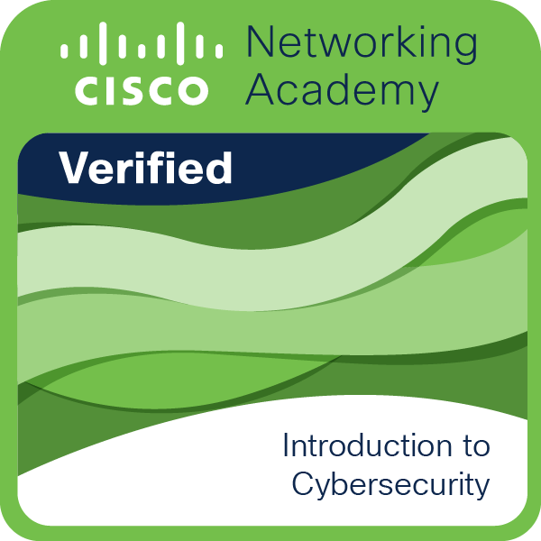
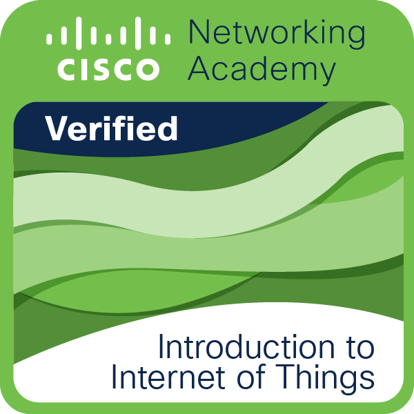
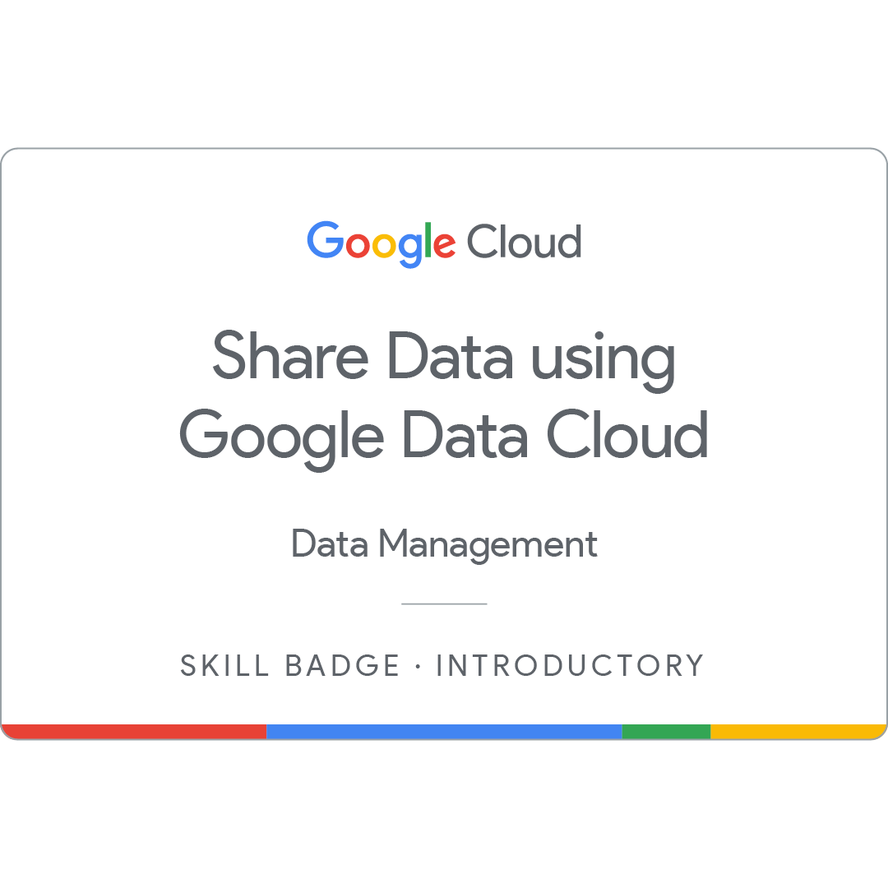

# 👋 Hi, I'm Himanshu Sharma!

### AI/ML Enthusiast & Software Engineer | Open to Full-time Roles

I'm a passionate developer focused on building intelligent systems, data-driven applications, and interactive simulations. Currently pursuing my **B.Tech in Computer Science (Artificial Intelligence & Machine Learning)** at Kalinga University, following a **CS Diploma** (9.17 CGPA), where I served as the Vice President of the CS & IT Department.

---

## 🚀 Interactive Portfolio Website

Check out my full personal portfolio, redesigned with a modern glassmorphic look, interactive particle network, scrolling timeline, project and skill category filters, and direct resume downloads:

👉 **[Explore my Live Portfolio Site!](https://himanshush31.github.io/My_Portfolio/)**

---

## 🛠️ My Technical Stack & Toolkit

### 🧠 Artificial Intelligence & Data Science

### 💻 Software & Web Development

### 🗄️ Databases & Cloud Services

---

## 💼 Work Experience

- **AI & Automation Intern** @ *Risedge Academy* (March 2026 - April 2026)
  - Researched and prototyped **Generative AI and Embedded Learning applications** for industrial automation workflows, optimizing task efficiency and documentation.
  - Compiled comprehensive technical reports detailing pipeline use-cases, tools, and performance outcomes for senior stakeholders.
  - Collaborated with cross-functional team members to design and brainstorm innovative AI solutions and system automation.
  - Created high-quality audio-visual educational materials to train external partners on newly deployed automation tools.
  - Delivered custom projects and software prototypes within strict sprints and deadlines, maintaining robust version control.

- **Python Developer Freelancer (Part-time)** @ *Outlier* (May 2025 - September 2025)
  - **Automation & Optimization:** Engineered 15+ Python automation scripts, reducing manual processing time by ~40% and system latency by ~30%.
  - **AI Integration:** Integrated AI-driven features into 3+ production environments, resolving critical system bottlenecks.

- **Prompt Engineer Freelancer (Part-time)** @ *Soul AI by Deccan AI* (February 2025 - May 2025)
  - **Prompt Engineering:** Designed 150+ high-quality LLM prompts, improving AI content consistency and quality scores by ~25%.
  - **Model Research:** Evaluated 10+ GenAI architectures; partnered with R&D teams to implement data-driven fine-tuning strategies.

---

## 📚 Publications & Conferences

- **National Conferences:**
  - **Presenter & Author:** Presented a research paper on optimizing **Convolutional Neural Networks (CNN) for medical sectors** (diagnostic and screening automation).
  - **Presenter & Author:** Presented a research paper on advanced **sentiment analysis using deep learning architectures**.
- **International Conferences:**
  - **Participant & Contributor:** Participated in two International Conferences focused on **Smart Technologies** and **Digital Transformation for Sustainable Development**.

---

## 🚀 Featured Projects & Repositories

| Project Card / Name | Tech Stack | Quick Links | Description |
| :--- | :--- | :--- | :--- |
| **💼 Personal Wealth Manager** | `Python`, `PyQt6`, `SQLite` | [📁 Repo](https://github.com/HimanshuSh31/Personal-Wealth-Manager) | Secure desktop app featuring encrypted storage and interactive Plotly visualization dashboards. |
| **🏥 Clinipharm_IQ** | `Python`, `SQL` | [📁 Repo](https://github.com/HimanshuSh31/Clinipharm_IQ) | Role-based operations dashboard with interactive database transactional workflows. |
| **👁️ Computer Vision Face Detector** | `Python`, `OpenCV`, `Dlib` | [📁 Repo](https://github.com/HimanshuSh31/Face-Detection) | Real-time object tracking utilizing CNNs, Haar Cascades, and HOG models. |
| **🎮 Customer is King** | `Unity`, `C#`, `Firebase` | [📁 Repo](https://github.com/HimanshuSh31/Customer-is-King) | Strategic business simulation game with database-driven broker trading environments. |
| **🎬 Movie Recommendation System** | `Python`, `Jupyter` | [📁 Repo](https://github.com/HimanshuSh31/Movie_Recommendation_System) | Personalized title selector implementing collaborative filtering and item-similarity engines. |
| **🏍️ Bike Showroom Management** | `C#`, `.NET`, `SQL Server` | [📁 Repo](https://github.com/HimanshuSh31/Bike_Showroom_Management) | Enterprise automation platform for inventory control, billing invoicing, and sales logs. |
| **🎵 Music Recommendation System** | `Python`, `Pandas`, `NumPy` | [📁 Repo](https://github.com/HimanshuSh31/Music_Recommendation_System) | Recommendation system generating popularity weights and cosine similarity suggestions. |
| **👾 Tic-Tac-Toe** | `HTML`, `CSS`, `JavaScript` | [📁 Repo](https://github.com/HimanshuSh31/Tic_Tac_Toe) · [🌐 Live Demo](https://himanshush31.github.io/Tic_Tac_Toe/) | Space-themed interactive Tic-Tac-Toe browser game featuring a responsive layout and nebula aesthetics. |
| **✊ Stone Paper Scissors** | `HTML`, `CSS`, `JavaScript` | [📁 Repo](https://github.com/HimanshuSh31/Stone_Paper_Scissor) · [🌐 Live Demo](https://himanshush31.github.io/Stone_Paper_Scissor/) | Classic hand-game simulator featuring score-tracking and automated computer decision logic. |
| **🧠 OnBoard NOVA** | `Python`, `Streamlit`, `LLMs` | [📁 Repo](https://github.com/HimanshuSh31/OnBoard_AI) | AI-powered onboarding assistant leveraging LLMs to streamline query resolution, reducing response times by ~40%. |
| **🤖 AegisPact.AI** | `Python`, `RAG`, `NLP`, `MLOps` | [📁 Repo](https://github.com/HimanshuSh31/AegisPact.AI) | Automated Multi-Modal Contract & Compliance Auditor with Hybrid RAG (Dense + BM25) and Ragas evaluation scorecards. |

---

## 🏅 Credly Badges

Verified digital credentials issued by accredited platforms:

&nbsp;&nbsp;
&nbsp;&nbsp;

---

## 📬 Let's Connect!

I'm currently seeking full-time roles in AI/ML engineering, data analysis, and software development. Feel free to reach out:

---
*“Code, Learn, and Build Intelligent Solutions.”*
